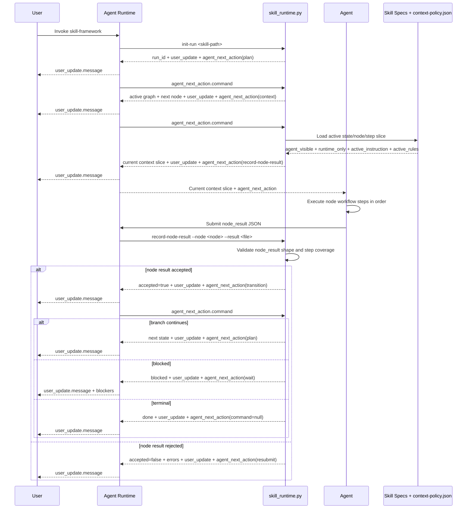
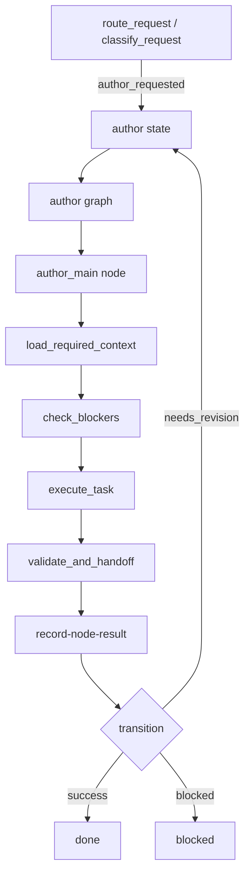
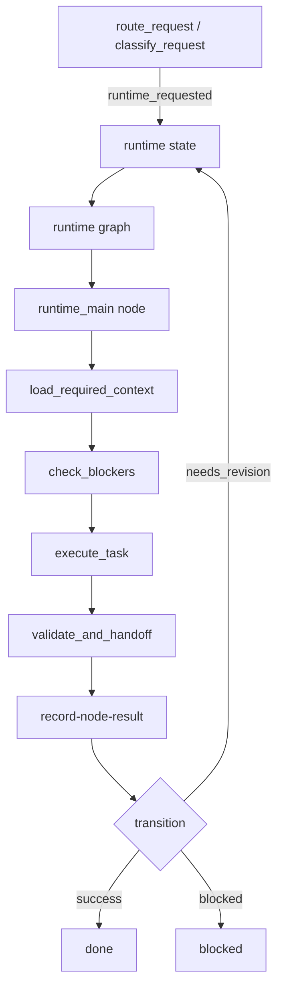
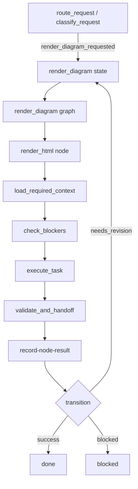

# Contribute

This document explains how the root `skill-framework` skill actually runs, where contributors should look first when changing behavior, and what each important file means.

[Open the standalone HTML diagram](assets/skill-framework-flow.html)

Use the HTML diagram to inspect the current tree shape of the root skill. Use this document to understand runtime behavior, branch boundaries, and the file-level contracts behind that diagram.

## If You Only Read One Path

Read these sections in order:

1. `Execution Mental Model`
2. `Runtime Sequence`
3. The capability branch you plan to change
4. `How The Files Work Together`
5. `Important File Semantics`

That path is the fastest way to understand how the system works before you start editing specs or scripts.

## What This Repo Is

`skill-framework` has two roles:

1. It is the framework used to author and validate other skills.
2. It is also a framework-compliant skill itself.

That means the repository contains both:

- framework assets and scripts used by other skills
- root-level workflow-program files that describe how `skill-framework` routes and executes its own requests

### What `skill-framework/v1` Means

The `"framework": "skill-framework/v1"` field is the framework identifier and version marker for runtime-executable specs.

It is not decorative. It tells readers and tools which spec family a JSON file belongs to. Today the validators do not enforce a specific literal value, but the framework, scaffolds, generated skills, runtime help text, and docs all consistently use `skill-framework/v1`.

Keep it because:

- it makes the spec family explicit
- it leaves room for future incompatible revisions
- it keeps generated skills and the framework self-description aligned

Do not remove it casually unless you are intentionally changing the framework versioning strategy everywhere.

## Design Philosophy

`skill-framework` exists to make skill behavior explicit enough to inspect, validate, replay, and evolve.

- Start with theory: define purpose, domain model, invariants, failure theory, and judgment rubric before workflow details.
- Use the state machine for lifecycle: user gates, blocked states, retry loops, recovery, and terminal states.
- Use the DAG inside each state for dependency order, artifact flow, context boundaries, and parallelizable analysis.
- Keep every node as a sequential micro-workflow with numbered steps and explicit completion criteria.
- Put hard constraints in `rules/`; use prose examples and background material as guidance, not enforcement.
- Let deterministic scripts handle parsing, validation, graph checks, rendering, naming, and repeatable transforms.
- Test behavior with pressure scenarios. File presence is only the structural baseline.

## Shared Context Loading Model

Root `skill-framework` and generated skills use the same loading semantics. They may have different states, nodes, scripts, and domain data, but the resource layers have the same responsibilities:

- `always_load`: loads `theory.md` and `rules/global.json` so every node has the active theory and global constraints.
- `on_state`: loads the active state's machine/graph runtime specs, state rules, and state-level scripts or contracts.
- `on_node`: loads the active node contract, node-result contract, node rules, and node-level scripts or artifact contracts.
- `on_step`: loads step-level rules, handoff contracts, and examples needed by the current step.
- `on_failure`: loads the contract needed to repair a rejected result.
- `on_validation`: loads runtime-only contracts used by deterministic validators.
- `never_load_unless_requested`: lists eval files and pressure scenarios used during explicit validation work.

Concrete generated skills can schedule domain references through their own `context-policy.json`. A reference is runtime material only when a specific state, node, or step declares why that reference is needed.

## Authoring Principles

Create a skill when it prevents a recurring failure or unlocks a repeatable expert workflow. Before writing instructions, name the failure:

- skipped prerequisite
- overwritten artifact
- unstable output format
- context overload
- missing validation
- weak domain judgment
- fragile tool sequence

Keep frontmatter `description` trigger-focused. It should say when to use the skill, not how to run the full workflow.

Keep `SKILL.md` thin. It should give the loaded-skill overview, core invariants, execution entrypoints, and links to exact resources. Formal structure belongs in machine, graph, contracts, rules, runtime, scripts, and evals.

Every skill should use the canonical workflow-program structure:

- theory
- machine
- node graph
- node contracts
- rules
- context policy
- artifact contracts
- evals

Skills differ by the number of states, nodes, rules, artifacts, references, scripts, and evals. Do not create lower-standard templates for simpler skills.

## Structural Examples

Use a one-state shape for a focused skill with one execution path:

```text
machine:
  execute -> done

graph execute:
  main

node main:
  step 1: load inputs
  step 2: apply rules
  step 3: produce output
  step 4: validate result
```

Use a composed shape for workflows with independent analysis nodes:

```text
machine:
  discover -> produce -> done

graph discover:
  inspect_files
  inspect_config
  summarize_context depends_on [inspect_files, inspect_config]

graph produce:
  draft_artifact
  validate_artifact depends_on [draft_artifact]
```

Use an orchestrated shape for human gates, recovery, and review:

```text
machine:
  recover -> plan -> execute -> review -> writeback -> done
  execute -> blocked
  review -> execute
  blocked -> recover
```

## Testing Method

Use a RED-GREEN-REFACTOR loop for skills:

1. RED: write a realistic prompt where an agent without the skill would likely fail.
2. GREEN: add the smallest rule, contract, node step, validator, or runtime behavior that prevents the failure.
3. REFACTOR: simplify wording, move deterministic pieces to scripts, and re-run scenarios.

Each pressure scenario should include an id, user-style prompt, expected behavior, forbidden behavior, and pass criteria. Scenarios should test behavior, not whether files contain specific phrases.

Good pressure scenarios force a choice under pressure: the user asks to skip a gate, a deterministic tool fails, a node tries to jump to output, or the prompt encourages bulk context loading. Structural checks belong in validators.

Runtime-capable skills should include checks for run initialization, active node planning, context slicing, valid and invalid node results, legal and illegal transitions, replay, and snapshot consistency.

## Anti-Patterns

- Prompt pile: a long instruction file replaces machine, graph, contracts, rules, scripts, and evals.
- Description leakage: frontmatter explains the whole workflow.
- Giant `SKILL.md`: domain knowledge and examples consume context before the active state is known.
- Hidden rules: hard constraints live only in prose.
- DAG as prose: dependency order is written in paragraphs instead of `node.graph.json`.
- Node without steps: a node can jump straight to output.
- Contract after output: artifact shape is defined after generation has already drifted.
- Script avoidance: deterministic work is repeatedly delegated to model reasoning.
- Bulk context loading: every spec, rule, reference, and eval enters normal node context.
- No recovery model: state cannot be derived from event logs and snapshots.
- Untested guardrail: important rules have no pressure scenarios.

## Execution Mental Model

The root `skill-framework` skill is a runtime-controlled workflow program, not a prompt blob.

- The runtime is the orchestrator. It owns run creation, planning, context slicing, event logging, state transitions, replay, and result acceptance.
- The agent executes only the active node contract and only with the active context slice.
- Every request starts in `route_request`, which decides whether the work belongs in `author`, `validate`, `runtime`, or `render_diagram`.
- `blocked` is the stop state for missing intent, missing inputs, or missing dependencies.
- `done` is the only terminal success state.

Machine states:

- `route_request`: classify the request
- `author`: create or evolve skills
- `validate`: validate skills
- `runtime`: operate the deterministic runtime
- `render_diagram`: generate standalone HTML
- `blocked`: stop on missing prerequisites
- `done`: terminal state

The important design rule is that `render_diagram` is an independent branch. It adds diagram rendering without changing the meaning of existing authoring, validation, or runtime requests.

## Runtime Sequence

Every branch follows the same runtime-controlled loop. The branch changes, but the protocol does not.



Three rules matter more than everything else around this loop:

- For work-advancing commands, the runtime protocol is two-step: relay `user_update.message` first, then execute `agent_next_action.command` when it is present.
- The agent does not get the whole spec. `context-policy.json` decides what is visible for the active state, node, and step.
- Only `blocked` waits for user input; `done` ends the run and reports completion.
- A node is not complete until `record-node-result` accepts it and `transition` advances the machine.

By default, run artifacts live under `.skill-framework/runs/<run-id>/`, with `events.jsonl`, `state.json`, `node-plan.json`, and `node-results/` controlled by `runtime.json`.

## Capability Branches

All requests pass through `route_request` first. The `classify_request` node chooses one of four capability branches by emitting one of these transitions:

- `author_requested`
- `validate_requested`
- `runtime_requested`
- `render_diagram_requested`

After that, the runtime loop stays inside the active branch until the branch reaches `done`, `blocked`, or a self-loop through `needs_revision`.

### `author`

Use this branch for skill creation, scaffold generation, upgrades, and structural evolution work.



How it runs:

- Entered from `route_request` on `author_requested`.
- The active graph is `author`, and the current root skill defines one node there: `author_main`.
- The runtime loads the active authoring state specs, `scripts/init_skill.py`, the `author_main` node contract, the node-result contract, and the current rules slice.
- `author_main` follows four required steps: load authoring context, check blockers, execute the authoring task, and validate the handoff.
- The branch should preserve existing authoring behavior. It should not quietly reinterpret authoring work into validation, runtime, or diagram rendering.

What deterministic tools and outputs matter:

- Primary deterministic tool: `scripts/init_skill.py`
- Primary context: active theory, state rule, node contract, node-result contract, scaffold script, and handoff rule
- Typical outputs: scaffolded skill files, upgraded workflow-program specs, or explicit blockers
- Legal transitions after acceptance: `success`, `needs_revision`, or `blocked`

### `validate`

Use this branch for machine, contracts, rules, context-policy, and eval validation work.


How it runs:

- Entered from `route_request` on `validate_requested`.
- The active graph is `validate`, and the current root skill defines one node there: `validate_main`.
- The runtime loads the active validation state specs, focused validator scripts, the `validate_main` node contract, the node-result contract, and the current rules slice.
- `validate_main` follows the same four-step shape: load context, check blockers, execute validation, validate the handoff.
- The branch chooses the matching validator path inside the branch. It must not reinterpret validation work as authoring or diagram rendering.

What deterministic tools and outputs matter:

- Primary tools: `scripts/validate_skill.py`, `scripts/validate_machine.py`, `scripts/validate_contracts.py`, and `scripts/run_skill_evals.py`
- Primary context: active theory, state rule, node contract, node-result contract, validator scripts, and handoff rule
- Typical outputs: validation reports, contract errors, eval mismatches, or explicit blockers
- Legal transitions after acceptance: `success`, `needs_revision`, or `blocked`

### `runtime`

Use this branch for runtime-control work on a target skill or run, such as initialization, planning, context inspection, replay, and validation of persisted run state.



How it runs:

- Entered from `route_request` on `runtime_requested`.
- The active graph is `runtime`, and the current root skill defines one node there: `runtime_main`.
- The runtime loads runtime-control context from `scripts/skill_runtime.py`, `contracts/runtime-state.json`, `contracts/runtime-event.json`, the active node contract, and the current rules slice.
- `runtime_main` checks that the request is really a runtime request and that the target skill path or run identifier is specific enough for the intended operation.
- This branch is about runtime operations themselves. It is not a back door for authoring or validation work.

What deterministic tools and outputs matter:

- Primary tool: `scripts/skill_runtime.py`
- Primary contracts: `contracts/runtime-state.json` and `contracts/runtime-event.json`
- Typical outputs: run metadata, node plans, context slices, replay results, run validation results, or explicit blockers
- Legal transitions after acceptance: `success`, `needs_revision`, or `blocked`

### `render_diagram`

Use this branch for whole-skill visualization that produces the official standalone HTML artifact.



How it runs:

- Entered from `route_request` on `render_diagram_requested`.
- The active graph is `render_diagram`, and the current root skill defines one node there: `render_html`.
- The runtime loads renderer-specific context from `scripts/render_skill_html.mjs`, the active node contract, and the current rules slice.
- `render_html` verifies that the target skill path is explicit and that the target exposes the machine, graph, and node-contract files required for rendering.
- Diagram rendering is its own branch. It must not fall back to DOT or SVG when the HTML path is blocked.

What deterministic tools and outputs matter:

- Primary tool: `scripts/render_skill_html.mjs`
- Supporting check when needed: `scripts/validate_machine.py`
- Required target inputs: `skill.machine.json`, `node.graph.json`, and `contracts/nodes.json`
- Final output: standalone HTML artifact, typically written to a file such as `skill-flow.html`
- Legal transitions after acceptance: `success`, `needs_revision`, or `blocked`

## How The Files Work Together

The collaboration chain is:

1. `SKILL.md` frontmatter triggers the skill.
2. `agents/metadata.json` biases default usage after trigger.
3. `skill.machine.json` decides lifecycle state.
4. `node.graph.json` selects DAG ordering inside that state.
5. `contracts/nodes.json` defines what each node must do, step by step.
6. `rules/*.json` constrain what is allowed at global, state, node, and step scope.
7. `context-policy.json` decides which of those resources the agent and runtime can see at each moment.
8. `runtime.json` defines deterministic execution behavior and persistence.
9. `contracts/*` define what valid artifacts, node results, and runtime objects look like.
10. `scripts/*` perform deterministic work.
11. `evals/*` test whether the whole behavior still matches the intended model.

## Common Edit Paths

If you change one layer, check the adjacent layers too:

- New state: update the machine, graph, context policy, runtime loop guards, and probably evals.
- New node: update the graph, node contract, context policy, and possibly rules.
- New deterministic script: update docs, context policy, and sometimes artifact contracts.
- New output artifact: update artifact contracts and eval expectations.
- New branch behavior: review the branch diagram, the node contract workflow, and the runtime transition vocabulary together.

## Repository Map

### Root skill files

- `SKILL.md`: Human-facing trigger and operating guide for the `skill-framework` skill.
- `theory.md`: Why the root skill exists, what capability branches it has, and the invariants it must preserve.
- `skill.machine.json`: The lifecycle state machine for `skill-framework` itself.
- `node.graph.json`: The per-state DAG definitions for the root skill.
- `context-policy.json`: Which resources are visible in each state, node, and step.
- `runtime.json`: Deterministic runtime configuration for root-skill execution.

### Contracts

- `contracts/nodes.json`: Sequential micro-workflows for each root-skill node.
- `contracts/artifacts.json`: What root-skill artifacts must exist and what they mean.
- `contracts/node-result.json`: Required shape of every node result.
- `contracts/runtime-state.json`: Required shape of persisted runtime state.
- `contracts/runtime-event.json`: Required shape of runtime event log entries.

### Rules

- `rules/global.json`: Cross-cutting invariants that cannot be bypassed.
- `rules/state/execute.json`: State-scoped execution constraints.
- `rules/node/main.json`: Node-scoped constraints shared by active nodes.
- `rules/step/validate-and-handoff.json`: Final handoff constraints.

### Framework assets

- `framework/*.schema.json`: Structural schemas for runtime-executable specs.
- `framework/philosophy.md`: Core framework design principles.
- `framework/ontology.yaml`: Canonical naming and concept definitions.

### Scripts

- `scripts/init_skill.py`: Scaffold a new canonical skill.
- `scripts/validate_skill.py`: Full validator.
- `scripts/validate_machine.py`: Focused machine and graph validation.
- `scripts/validate_contracts.py`: Focused contracts, rules, and context-policy validation.
- `scripts/run_skill_evals.py`: Eval definition checks.
- `scripts/skill_runtime.py`: Deterministic local runtime.
- `scripts/render_skill_html.mjs`: Render the whole skill runtime tree as a standalone HTML page using a bundled G6 indented tree and right-side click details.

### Evals

- `evals/expected-behaviors.json`: Structured expected and forbidden behaviors.
- `evals/pressure-scenarios.md`: Human-readable pressure scenarios matching those ids.
- `evals/framework-pressure-scenarios.md`: Additional framework-level pressure scenarios.

### Scaffolds

- `scaffolds/canonical-skill/`: The baseline structure copied into generated skills.

### Agent interface

- `agents/metadata.json`: UI-facing and invocation-facing metadata for the skill.

## Important File Semantics

### `skill.machine.json`

Important fields:

- `machine.initial`: first lifecycle state
- `machine.terminal`: terminal states
- `machine.states.<state>.purpose`: why the state exists
- `machine.states.<state>.graph`: which DAG to run inside the state
- `machine.states.<state>.on`: legal transitions keyed by event name
- `machine.states.<state>.recovery`: how the runtime should think about resume or replay

Meaning:

- the machine controls lifecycle and gating
- it does not define node order inside a state
- event labels in `on` become the legal transition vocabulary

### `node.graph.json`

Important fields:

- `graphs.<graph_id>.execution.mode`: DAG execution mode
- `graphs.<graph_id>.nodes.<node>.contract`: pointer into `contracts/nodes.json`
- `graphs.<graph_id>.nodes.<node>.depends_on`: DAG dependencies
- `graphs.<graph_id>.nodes.<node>.writes`: logical write set for conflict checking

Meaning:

- one graph belongs to one machine state
- DAG ordering lives here, not in prose
- node dependencies are structural and validator-visible

### `contracts/nodes.json`

Important fields:

- `kind`: execution unit type
- `execution`: must be `sequential`
- `purpose`: why the node exists
- `instruction`: branch-specific invariant guidance
- `inputs` / `outputs`: logical interface of the node
- `allowed_reads` / `allowed_writes`: resources the node may touch
- `workflow`: numbered micro-workflow steps
- `workflow[].stop_if`: explicit blocking condition
- `workflow[].done_when`: concrete completion signal
- `validators`: contracts used to validate outputs

Meaning:

- this is the executable contract for node behavior
- numbered steps are the only valid place for intra-node ordering
- if a node changes shape, update both its graph reference and contract

### `context-policy.json`

Important fields:

- `always_load`: resources always visible
- `on_state`: resources loaded on entering a state
- `on_node`: resources loaded for a specific node
- `on_step`: resources loaded only for a specific step
- `never_load_unless_requested`: resources kept out of normal execution
- `audience`: `agent_visible`, `runtime_only`, or `both`

Meaning:

- this file prevents context overload
- runtime may know the whole spec, but the executing agent should only see the active slice
- every added script, reference, or contract should be placed deliberately in this schedule

### `runtime.json`

Important fields:

- `run_dir`: where run data lives
- `event_log`: append-only event storage
- `snapshot`: persisted state snapshot
- `node_plan`: topological node plan file
- `node_results`: persisted node-result directory and acceptance settings
- `loop_guards`: anti-loop controls
- `context_slicing`: visibility and batching controls

Meaning:

- this is deterministic runtime policy, not agent guidance prose
- if lifecycle behavior changes, runtime expectations usually need to change too

### `contracts/artifacts.json`

Important fields:

- `path`: where the artifact lives
- `kind`: markdown, json, script, or other asset type
- `required`: whether the artifact must exist
- `sections`: required markdown sections when applicable
- `validator`: focused validator attached to the artifact

Meaning:

- this file explains what “complete” means for root artifacts
- keep `skill_entrypoint.sections` aligned with the actual top-level structure of the root `SKILL.md`; scaffold entrypoints should follow the same section pattern
- use it when adding new root-level executable specs or required docs

### `rules/*.json`

Important fields:

- `id`: stable rule identifier
- `scope`: global, state, node, or step
- `applies_to`: target scope when needed
- `priority`: rule precedence hint
- `statement`: enforceable requirement
- `forbidden`: optional examples of what violates the rule

Meaning:

- rules are hard constraints, not background explanation
- if a constraint matters to execution, put it here rather than only in prose

### `evals/*`

Important fields:

- `expected-behaviors.json.scenarios[].id`: stable scenario id
- `prompt`: pressure prompt
- `expected_behavior`: what must happen
- `forbidden_behavior`: what must not happen
- `pass_criteria`: what success looks like

Meaning:

- JSON evals are the structured source of truth
- markdown pressure scenarios should mirror the same ids for human review

### `agents/metadata.json`

Important fields:

- `display_name`: UI name
- `short_description`: short scan-friendly summary
- `default_prompt`: default execution bias after trigger
- `allow_implicit_invocation`: whether the skill may be auto-triggered

Meaning:

- this file helps the agent know how to use the skill once triggered
- it does not replace the need for `SKILL.md` frontmatter description

## Markdown Usage Map

This section explains the markdown roles in the root framework.

- `SKILL.md`: runtime-loaded, script-read, and validator-required. Routing uses it as the public trigger surface, and the HTML renderer may read it for summary text.
- `theory.md`: runtime-loaded, script-read, and validator-required. It supplies the root skill purpose, domain model, invariants, failure theory, and judgment rubric.
- `README.md`: human entrypoint. It explains what the project is, what it is for, its goals, its philosophy, and how to start.
- `CONTRIBUTE.md`: human maintainer guide. It contains execution details, file semantics, authoring principles, structural examples, testing method, and anti-patterns.
- `framework/philosophy.md`: human framework background and validator-required framework asset.
- `evals/pressure-scenarios.md`: script-read and validator-required pressure scenario prose.
- `evals/framework-pressure-scenarios.md`: validator-required framework-level pressure scenario prose.
- `scaffolds/canonical-skill/SKILL.md`, `scaffolds/canonical-skill/theory.md`, and `scaffolds/canonical-skill/evals/pressure-scenarios.md`: template markdown copied by `scripts/init_skill.py`.

Normal runtime execution uses the shared context loading model in `context-policy.json`. Generated skills can include domain references when their own context policy assigns those references to an active state, node, or step.

## Contributor Guidelines

- Keep frontmatter `description` trigger-focused. It should say when to use the skill, not how to execute it.
- Add new capabilities as independent workflow branches when possible instead of overloading an existing branch.
- Prefer adding deterministic scripts over embedding repeatable procedures in long prose.
- Validate the root `skill-framework` skill after structural changes.
- Validate the canonical scaffold when changes affect generated-skill expectations.
- When changing the meaning of a spec field, update both docs and validators together.

## Recommended Checks

If your environment does not provide `python`, use `python3` for the Python commands below.

For root-skill changes:

```bash
python scripts/validate_skill.py .
python scripts/validate_machine.py .
python scripts/validate_contracts.py .
node scripts/render_skill_html.mjs . -o /tmp/skill-framework-flow.html
```

For scaffold-impacting changes:

```bash
python scripts/validate_skill.py scaffolds/canonical-skill
```
